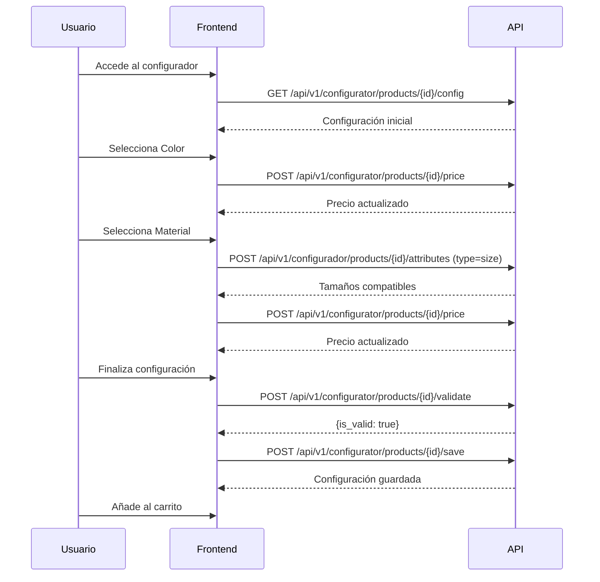

# API del Configurador de Productos - Documentación Completa

## Tabla de Contenidos

1. [Introducción](#introducción)
2. [Autenticación](#autenticación)
3. [Endpoints del Configurador](#endpoints-del-configurador)
4. [Modelos de Datos](#modelos-de-datos)
5. [Flujo de Configuración](#flujo-de-configuración)
6. [Ejemplos Completos](#ejemplos-completos)
7. [Manejo de Errores](#manejo-de-errores)
8. [Códigos de Estado HTTP](#códigos-de-estado-http)

---

## Introducción

Esta API REST permite a los clientes configurar productos personalizados de manera dinámica. El sistema soporta:

- **Atributos configurables**: Color, material, tamaño, sistema de impresión, tinta, cantidad
- **Dependencias entre atributos**: Reglas que permiten, bloquean o requieren atributos
- **Precio dinámico**: Cálculo automático basado en selección, cantidad y reglas
- **Auto-selección**: Atributos que se seleccionan automáticamente según dependencias
- **Validación completa**: Verifica que la configuración cumpla todas las reglas
- **Recomendaciones inteligentes**: Sugiere tintas basándose en contraste de color

### Base URL

```
Producción: https://tudominio.com/api/v1
Desarrollo: http://localhost/api/v1
```

### Formato de Respuestas

Todas las respuestas exitosas siguen este formato:

```json
{
  "success": true,
  "data": { ... }
}
```

Respuestas de error:

```json
{
  "success": false,
  "message": "Mensaje de error",
  "errors": { ... }
}
```

---

## Autenticación

La mayoría de endpoints son **públicos** y no requieren autenticación.

Los endpoints que guardan/recuperan configuraciones requieren **sesión web** (cookies).

Para endpoints protegidos del admin, se usa **Laravel Sanctum**:

```http
Authorization: Bearer {token}
```

---

## Endpoints del Configurador

### 1. Obtener Configuración Inicial

Obtiene toda la información necesaria para inicializar el configurador de un producto.

**Endpoint:**
```
GET /api/v1/configurator/products/{product}/config
```

**Parámetros de Ruta:**
- `product` (integer|string): ID o slug del producto

**Respuesta Exitosa (200):**

```json
{
  "success": true,
  "data": {
    "product": {
      "id": 1,
      "name": "Servilletas Personalizadas",
      "slug": "servilletas-personalizadas",
      "sku": "SERV-001",
      "description": "Servilletas de papel personalizables...",
      "configurator_description": "Configura tus servilletas...",
      "images": ["/images/servilleta-1.jpg"],
      "model_3d_file": "/models/servilleta.glb",
      "has_configurator": true,
      "configurator_base_price": 0.15,
      "max_print_colors": 4,
      "allow_file_upload": true,
      "file_upload_types": ["jpg", "png", "svg", "pdf"],
      "face_count": 1,
      "print_colors_count": 4,
      "active": true,
      "category_id": 2,
      "created_at": "2025-01-01T00:00:00.000000Z",
      "updated_at": "2025-01-15T10:30:00.000000Z"
    },
    "attributes_by_type": {
      "color": [
        {
          "id": 1,
          "attribute_group_id": 1,
          "type": "color",
          "name": "Blanco",
          "value": "WHITE",
          "slug": "blanco",
          "description": "Color blanco clásico",
          "hex_code": "#FFFFFF",
          "pantone_code": null,
          "ral_code": null,
          "image_path": null,
          "thumbnail_path": null,
          "price_modifier": 0,
          "price_percentage": 0,
          "stock_quantity": 10000,
          "weight_modifier": 0,
          "compatible_materials": null,
          "incompatible_with": null,
          "requires_file_upload": false,
          "metadata": {
            "luminosity": 1.0,
            "color_family": "white",
            "finish_type": "matte"
          },
          "sort_order": 1,
          "active": true,
          "is_recommended": true,
          "is_default": true,
          "is_available": true,
          "min_quantity": null,
          "max_quantity": null,
          "additional_production_days": null
        }
        // ... más colores
      ],
      "material": [ /* ... */ ],
      "size": [ /* ... */ ],
      "system": [ /* ... */ ],
      "ink": [ /* ... */ ],
      "quantity": [ /* ... */ ]
    },
    "attribute_groups": [
      {
        "id": 1,
        "name": "Color",
        "type": "color",
        "sort_order": 1,
        "is_required": true,
        "allow_multiple": false,
        "affects_price": true
      },
      {
        "id": 2,
        "name": "Material",
        "type": "material",
        "sort_order": 2,
        "is_required": true,
        "allow_multiple": false,
        "affects_price": true
      }
      // ... más grupos
    ],
    "dependencies": [
      {
        "id": 1,
        "parent_attribute_id": 16,
        "dependent_attribute_id": 20,
        "condition_type": "requires",
        "price_impact": null,
        "price_modifier": 5.00,
        "auto_select": true,
        "priority": 10
      }
      // ... más dependencias
    ],
    "pricing_info": {
      "base_price": 0.15,
      "pricing_ranges": [
        {
          "quantity_from": 1,
          "quantity_to": 1000,
          "price": 150.00,
          "unit_price": 0.15
        },
        {
          "quantity_from": 1001,
          "quantity_to": 5000,
          "price": 700.00,
          "unit_price": 0.14
        }
        // ... más rangos
      ],
      "max_print_colors": 4
    }
  }
}
```

**Códigos de Estado:**
- `200`: Configuración obtenida correctamente
- `404`: Producto no encontrado o sin configurador

---

### 2. Obtener Atributos Disponibles

Obtiene atributos filtrados según la selección actual, aplicando reglas de compatibilidad y dependencias.

**Endpoint:**
```
POST /api/v1/configurator/products/{product}/attributes
```

**Parámetros de Ruta:**
- `product` (integer): ID del producto

**Body (JSON):**
```json
{
  "type": "material",
  "selection": [1, 5, 12],
  "product_id": 1
}
```

**Parámetros del Body:**
- `type` (string, required): Tipo de atributo. Valores: `color`, `material`, `size`, `ink`, `system`, `quantity`
- `selection` (array, optional): Array de IDs de atributos ya seleccionados
- `product_id` (integer, required): ID del producto

**Respuesta Exitosa (200):**

```json
{
  "success": true,
  "data": [
    {
      "id": 16,
      "attribute_group_id": 2,
      "type": "material",
      "name": "Airlaid",
      "value": "AIRLAID",
      "description": "Material premium tipo tela",
      "price_modifier": 0.02,
      "active": true,
      "is_available": true,
      "metadata": {
        "material_type": "non-woven",
        "thickness": "50",
        "thickness_unit": "gsm",
        "surface_finish": "embossed"
      }
    }
    // ... más materiales compatibles
  ]
}
```

**Códigos de Estado:**
- `200`: Atributos obtenidos correctamente
- `422`: Validación fallida (parámetros inválidos)

---

### 3. Calcular Precio Dinámico

Calcula el precio total basado en atributos seleccionados, cantidad, dependencias y reglas de precio.

**Endpoint:**
```
POST /api/v1/configurator/products/{product}/price
```

**Body (JSON):**
```json
{
  "product_id": 1,
  "selection": [1, 16, 20, 24],
  "quantity": 5000
}
```

**Parámetros del Body:**
- `product_id` (integer, required): ID del producto
- `selection` (array, required): Array de IDs de atributos seleccionados
- `quantity` (integer, optional): Cantidad (default: 1)

**Respuesta Exitosa (200):**

```json
{
  "success": true,
  "data": {
    "pricing": {
      "unit_price": 0.1520,
      "total_price": 760.00,
      "base_price": 0.14,
      "attribute_modifiers": 0.02,
      "dependency_impact": 0.00,
      "volume_discount_percentage": 0,
      "quantity": 5000
    },
    "certifications": [
      "FSC",
      "EU Ecolabel"
    ],
    "production_time_days": 10
  }
}
```

**Desglose del Cálculo:**
```
Base Price (por cantidad):     €0.14
+ Modificadores de atributos:  €0.02
+ Impacto de dependencias:     €0.00
- Descuento por volumen:       €0.00
= Precio unitario:             €0.152
× Cantidad:                    5000
= Precio total:                €760.00
```

**Códigos de Estado:**
- `200`: Precio calculado correctamente
- `422`: Validación fallida

---

### 4. Validar Configuración

Valida que la configuración cumpla todas las reglas de negocio y dependencias.

**Endpoint:**
```
POST /api/v1/configurator/products/{product}/validate
```

**Body (JSON):**
```json
{
  "product_id": 1,
  "selection": [1, 16, 20, 24, 30, 36]
}
```

**Parámetros del Body:**
- `product_id` (integer, required): ID del producto
- `selection` (array, required): Array de IDs de atributos seleccionados

**Respuesta Exitosa (200):**

```json
{
  "success": true,
  "data": {
    "is_valid": true,
    "errors": []
  }
}
```

**Respuesta con Errores de Validación:**

```json
{
  "success": true,
  "data": {
    "is_valid": false,
    "errors": [
      "Debe seleccionar un valor para: Tinta",
      "El atributo 'Sistema UV' requiere el atributo 'Material Sintético'"
    ]
  }
}
```

**Códigos de Estado:**
- `200`: Validación ejecutada (revisar `is_valid`)
- `422`: Parámetros inválidos

---

### 5. Obtener Tintas Recomendadas

Recomienda tintas basándose en el contraste con el color de fondo seleccionado.

**Endpoint:**
```
POST /api/v1/configurator/inks/recommended
```

**Body (JSON):**
```json
{
  "color_hex": "#000000",
  "material_type": "paper"
}
```

**Parámetros del Body:**
- `color_hex` (string, required): Código hexadecimal del color (#RRGGBB)
- `material_type` (string, optional): Tipo de material

**Respuesta Exitosa (200):**

```json
{
  "success": true,
  "data": {
    "recommended_inks": [
      {
        "id": 24,
        "name": "Tinta Blanca",
        "hex_code": "#FFFFFF",
        "price_modifier": 0.01,
        "metadata": {
          "ink_type": "water-based",
          "opacity": "high",
          "durability": "standard"
        }
      },
      {
        "id": 25,
        "name": "Tinta Plateada Metálica",
        "hex_code": "#C0C0C0",
        "price_modifier": 0.03,
        "metadata": {
          "ink_type": "metallic",
          "is_metallic": true
        }
      }
    ],
    "contrast_info": {
      "luminosity": 0.0,
      "is_light": false,
      "recommended_ink_type": "light_or_metallic"
    }
  }
}
```

**Lógica de Recomendación:**
- **Color oscuro (luminosidad < 0.5)**: Recomienda tintas claras o metálicas
- **Color claro (luminosidad > 0.5)**: Recomienda tintas oscuras

**Códigos de Estado:**
- `200`: Recomendaciones generadas correctamente
- `422`: Formato de color hex inválido

---

### 6. Guardar Configuración

Guarda la configuración del usuario para recuperarla después (requiere sesión).

**Endpoint:**
```
POST /api/v1/configurator/products/{product}/save
```

**Requiere:** Middleware `web` (sesión activa)

**Body (JSON):**
```json
{
  "product_id": 1,
  "selection": [1, 16, 20, 24, 30, 36],
  "quantity": 5000
}
```

**Respuesta Exitosa (201):**

```json
{
  "success": true,
  "data": {
    "id": 42,
    "product_id": 1,
    "user_id": null,
    "attributes_base": [1, 16, 20, 24, 30, 36],
    "personalization": null,
    "files": null,
    "calculated": null,
    "status": "draft",
    "is_valid": false,
    "validation_errors": null,
    "expires_at": "2025-01-22T10:30:00.000000Z",
    "created_at": "2025-01-15T10:30:00.000000Z",
    "updated_at": "2025-01-15T10:30:00.000000Z"
  }
}
```

**Códigos de Estado:**
- `201`: Configuración guardada
- `422`: Validación fallida

---

### 7. Obtener Configuración Guardada

Recupera la configuración guardada para el usuario actual (requiere sesión).

**Endpoint:**
```
GET /api/v1/configurator/products/{product}/configuration?product_id=1
```

**Requiere:** Middleware `web` (sesión activa)

**Query Parameters:**
- `product_id` (integer, required): ID del producto

**Respuesta Exitosa (200):**

```json
{
  "success": true,
  "data": {
    "id": 42,
    "product_id": 1,
    "attributes_base": [1, 16, 20, 24, 30, 36],
    "status": "draft",
    "is_valid": false,
    "expires_at": "2025-01-22T10:30:00.000000Z"
  }
}
```

**Códigos de Estado:**
- `200`: Configuración encontrada
- `404`: No se encontró configuración
- `422`: Parámetro product_id faltante

---

## Modelos de Datos

### Product (Producto)

```typescript
{
  id: number,
  name: string,
  slug: string,
  sku: string,
  description?: string,
  configurator_description?: string,
  images?: string[],
  model_3d_file?: string,
  has_configurator: boolean,
  configurator_base_price: number,
  max_print_colors?: number,
  allow_file_upload: boolean,
  file_upload_types?: string[],
  configurator_rules?: object,
  configurator_settings?: object,
  face_count?: number,
  print_colors_count?: number,
  active: boolean,
  category_id?: number,
  subcategory_id?: number,
  created_at: string (ISO 8601),
  updated_at: string (ISO 8601)
}
```

### ProductAttribute (Atributo)

```typescript
{
  id: number,
  attribute_group_id: number,
  type: "color" | "material" | "size" | "ink" | "system" | "quantity",
  name: string,
  value: string,
  slug: string,
  description?: string,
  hex_code?: string,      // Solo para color/ink
  pantone_code?: string,
  ral_code?: string,
  image_path?: string,
  thumbnail_path?: string,
  price_modifier: number,
  price_percentage: number,
  stock_quantity?: number,
  weight_modifier: number,
  compatible_materials?: number[],
  incompatible_with?: number[],
  requires_file_upload: boolean,
  metadata?: object,
  sort_order: number,
  active: boolean,
  is_recommended: boolean,
  is_default: boolean,
  is_available: boolean,
  min_quantity?: number,
  max_quantity?: number,
  additional_production_days?: number
}
```

### AttributeGroup (Grupo de Atributos)

```typescript
{
  id: number,
  name: string,
  type: string,
  sort_order: number,
  is_required: boolean,
  allow_multiple: boolean,
  affects_price: boolean
}
```

### AttributeDependency (Dependencia)

```typescript
{
  id: number,
  parent_attribute_id: number,
  dependent_attribute_id?: number,
  condition_type: "allows" | "blocks" | "requires" | "sets_price" | "price_modifier",
  price_impact?: number,
  price_modifier?: number,
  auto_select: boolean,
  priority: number
}
```

**Tipos de Dependencia:**
- **allows**: Permite seleccionar el atributo dependiente
- **blocks**: Bloquea la selección del atributo dependiente
- **requires**: Requiere que se seleccione el atributo dependiente
- **sets_price**: Modifica el precio (legacy)
- **price_modifier**: Modifica el precio del atributo individual

### ProductConfiguration (Configuración)

```typescript
{
  id: number,
  product_id: number,
  user_id?: number,
  attributes_base: number[],  // Array de IDs
  personalization?: object,
  files?: object,
  calculated?: object,
  status: "draft" | "completed" | "ordered",
  is_valid: boolean,
  validation_errors?: string[],
  expires_at: string (ISO 8601),
  created_at: string (ISO 8601),
  updated_at: string (ISO 8601)
}
```

---

## Flujo de Configuración

### Flujo Típico del Usuario



### Paso a Paso

1. **Inicialización:**
   ```javascript
   const config = await fetch('/api/v1/configurator/products/1/config');
   ```

2. **Selección de Atributos:**
   - Usuario selecciona atributo
   - Frontend actualiza estado local
   - Llama a `/price` para actualizar precio
   - Opcionalmente llama a `/attributes` para obtener siguientes atributos compatibles

3. **Auto-Selección:**
   - Si una dependencia tiene `auto_select: true`
   - El frontend debe verificar la respuesta de `/config` o `/attributes`
   - Y auto-seleccionar el atributo correspondiente

4. **Validación:**
   - Antes de permitir "Añadir al Carrito"
   - Llamar a `/validate` para asegurar configuración válida

5. **Guardar:**
   - Llamar a `/save` para persistir la configuración
   - Asociar el `configuration_id` con el item del carrito

---

## Ejemplos Completos

### Ejemplo 1: Configuración Básica con JavaScript

```javascript
class ProductConfigurator {
  constructor(productId) {
    this.productId = productId;
    this.baseUrl = '/api/v1/configurator';
    this.selection = [];
  }

  async initialize() {
    const response = await fetch(`${this.baseUrl}/products/${this.productId}/config`);
    const data = await response.json();

    if (data.success) {
      this.config = data.data;
      this.renderAttributes();
    }
  }

  async selectAttribute(attributeId) {
    // Manejar selección única por tipo
    const attribute = this.findAttribute(attributeId);
    const existingIndex = this.selection.findIndex(id => {
      const attr = this.findAttribute(id);
      return attr.type === attribute.type;
    });

    if (existingIndex !== -1) {
      this.selection.splice(existingIndex, 1);
    }
    this.selection.push(attributeId);

    // Aplicar auto-selección si hay dependencias
    this.applyAutoSelections();

    // Actualizar precio
    await this.updatePrice();
  }

  applyAutoSelections() {
    this.config.dependencies.forEach(dep => {
      if (dep.auto_select && this.selection.includes(dep.parent_attribute_id)) {
        if (!this.selection.includes(dep.dependent_attribute_id)) {
          this.selection.push(dep.dependent_attribute_id);
        }
      }
    });
  }

  async updatePrice() {
    const response = await fetch(`${this.baseUrl}/products/${this.productId}/price`, {
      method: 'POST',
      headers: { 'Content-Type': 'application/json' },
      body: JSON.stringify({
        product_id: this.productId,
        selection: this.selection,
        quantity: this.quantity
      })
    });

    const data = await response.json();
    if (data.success) {
      this.displayPrice(data.data.pricing);
    }
  }

  async validate() {
    const response = await fetch(`${this.baseUrl}/products/${this.productId}/validate`, {
      method: 'POST',
      headers: { 'Content-Type': 'application/json' },
      body: JSON.stringify({
        product_id: this.productId,
        selection: this.selection
      })
    });

    const data = await response.json();
    return data.data.is_valid;
  }

  async save() {
    const response = await fetch(`${this.baseUrl}/products/${this.productId}/save`, {
      method: 'POST',
      headers: { 'Content-Type': 'application/json' },
      credentials: 'include', // Para enviar cookies de sesión
      body: JSON.stringify({
        product_id: this.productId,
        selection: this.selection,
        quantity: this.quantity
      })
    });

    const data = await response.json();
    return data.data.id; // ID de la configuración guardada
  }

  findAttribute(id) {
    for (const [type, attributes] of Object.entries(this.config.attributes_by_type)) {
      const attr = attributes.find(a => a.id === id);
      if (attr) return attr;
    }
    return null;
  }
}

// Uso
const configurator = new ProductConfigurator(1);
await configurator.initialize();
await configurator.selectAttribute(1); // Selecciona color
await configurator.selectAttribute(16); // Selecciona material
const isValid = await configurator.validate();
if (isValid) {
  const configId = await configurator.save();
  console.log('Configuración guardada con ID:', configId);
}
```

### Ejemplo 2: Recomendación de Tintas con React

```javascript
import React, { useState, useEffect } from 'react';

function InkRecommender({ selectedColor }) {
  const [recommendations, setRecommendations] = useState(null);

  useEffect(() => {
    if (selectedColor?.hex_code) {
      fetchRecommendations(selectedColor.hex_code);
    }
  }, [selectedColor]);

  async function fetchRecommendations(hexCode) {
    const response = await fetch('/api/v1/configurator/inks/recommended', {
      method: 'POST',
      headers: { 'Content-Type': 'application/json' },
      body: JSON.stringify({
        color_hex: hexCode,
        material_type: 'paper'
      })
    });

    const data = await response.json();
    if (data.success) {
      setRecommendations(data.data);
    }
  }

  if (!recommendations) return null;

  return (
    <div className="ink-recommender">
      <h3>Tintas Recomendadas</h3>
      <p>
        Color seleccionado: {selectedColor.name}
        ({recommendations.contrast_info.is_light ? 'Claro' : 'Oscuro'})
      </p>
      <div className="recommended-inks">
        {recommendations.recommended_inks.map(ink => (
          <div key={ink.id} className="ink-option">
            <div
              className="ink-preview"
              style={{ backgroundColor: ink.hex_code }}
            />
            <span>{ink.name}</span>
            {ink.price_modifier > 0 && (
              <span className="price">+€{ink.price_modifier.toFixed(2)}</span>
            )}
          </div>
        ))}
      </div>
    </div>
  );
}
```

### Ejemplo 3: Validación y Mensajes de Error

```javascript
async function validateAndShowErrors(configurator) {
  const response = await fetch(`/api/v1/configurator/products/${configurator.productId}/validate`, {
    method: 'POST',
    headers: { 'Content-Type': 'application/json' },
    body: JSON.stringify({
      product_id: configurator.productId,
      selection: configurator.selection
    })
  });

  const data = await response.json();

  if (!data.data.is_valid) {
    // Mostrar errores al usuario
    const errorList = document.getElementById('validation-errors');
    errorList.innerHTML = '';

    data.data.errors.forEach(error => {
      const li = document.createElement('li');
      li.className = 'error-message';
      li.textContent = error;
      errorList.appendChild(li);
    });

    // Deshabilitar botón de añadir al carrito
    document.getElementById('add-to-cart').disabled = true;
    return false;
  }

  // Habilitar botón de añadir al carrito
  document.getElementById('add-to-cart').disabled = false;
  return true;
}
```

---

## Manejo de Errores

### Errores de Validación (422)

```json
{
  "success": false,
  "errors": {
    "type": ["El campo type es obligatorio."],
    "color_hex": ["El formato del campo color hex es inválido."]
  }
}
```

### Error de Recurso No Encontrado (404)

```json
{
  "success": false,
  "message": "Producto no encontrado."
}
```

### Error del Servidor (500)

```json
{
  "success": false,
  "message": "Error interno del servidor. Por favor, intente nuevamente."
}
```

---

## Códigos de Estado HTTP

| Código | Significado | Uso en la API |
|--------|-------------|---------------|
| 200 | OK | Solicitud exitosa |
| 201 | Created | Recurso creado (configuración guardada) |
| 400 | Bad Request | Solicitud malformada |
| 404 | Not Found | Producto/recurso no encontrado |
| 422 | Unprocessable Entity | Errores de validación |
| 500 | Internal Server Error | Error del servidor |

---

## Notas de Implementación

### CORS

Si el frontend está en un dominio diferente, asegúrate de configurar CORS:

```php
// El proyecto ya tiene CorsMiddleware configurado
// Verifica config/cors.php
```

### Límites de Tasa (Rate Limiting)

Recomendamos implementar rate limiting:

```php
// En routes/api.php
Route::middleware('throttle:60,1')->group(function () {
    // Rutas del configurador
});
```

### Caché

Para mejorar el rendimiento:

```php
// El controlador ya usa caché en algunos endpoints
// Ajusta el tiempo de caché en ProductConfiguratorController
```

### Sesiones para Configuraciones Guardadas

Los endpoints `/save` y `/configuration` requieren middleware `web` para mantener sesión:

```php
Route::post('products/{product}/save', ...)
    ->middleware('web');
```

Asegúrate de que tu frontend envíe cookies:

```javascript
fetch('/api/v1/configurator/products/1/save', {
  method: 'POST',
  credentials: 'include', // ← Importante
  // ...
});
```

---

## Soporte

Para preguntas o problemas con la API:

- **Email**: soporte@tudominio.com
- **Documentación técnica**: `/docs/api`
- **Estado de la API**: `/api/health`

---

## Changelog

### v1.0.0 (2025-01-15)
- Lanzamiento inicial de la API del configurador
- Endpoints para configuración, precio, validación
- Soporte para dependencias y auto-selección
- Recomendación inteligente de tintas

---

**Última actualización:** 15 de Enero de 2025
**Versión de la API:** v1.0.0
